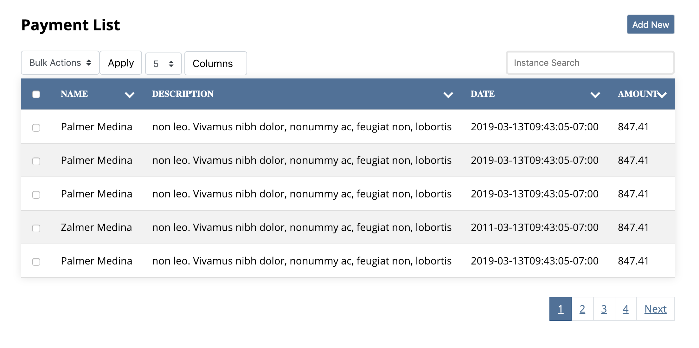
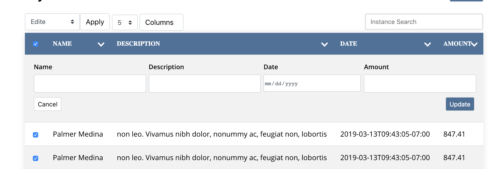
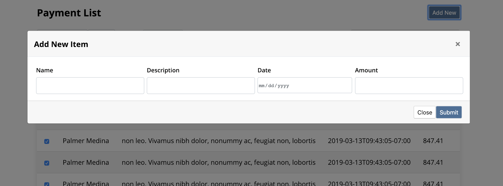

# VUE Table AK

Interactive table is responsive VUE table component with powerful features which give you the flexibility to use in any web projects and with any backend.


In the botton of README I have included the basic of useage with Laraval as backend. [Laraval](#config-object)
 
 
## VUE Table AK Components Features

* Add new item 
* Bulk edit and delete action
* Instance local search or remote search
* Pagination 
* Limit perPage 
* Column sorting Desc or ASC
* In-line editing
* in-line bulk actions
* Responsive
* Filter by Date
* Column toggling
* Reusable
* Configurable

## Prerequisite

-  This package is vue Components so you must have VUE in order to use it.
-  Your data must contain any kind of unique key in order the Table action (Edit , InlineEdit , Delete ) to work properly. If you didn't specifiy the unique key the components by default will consider that your feed contain property called **id** and look for that unique key if the component coudn't find it, the bulk actions will be disabled even if you enabled it in the configuration. Of course you can change the default behavior to use any other field as long as it's uniqe for example if your unique key is **sku** you can define that in the configuration for more details please check the config section. [please check the config section](#config-object)


## Usage

This components accept two Props : 

- **feed** (Required) type `Array` : this is the main data source for the table to render the HTML content if the feed is not valid or empty an error page will be displayed
- **Config** (Optional) type `Object`: The config Probs allow you to configure the table features based on your requreiments and it's completely optional if not specified the default configuration will be used.

 

**exmaple without the config option:**

```html
 <vue-table-ak feed="data" ></vue-table-ak>
``` 

**exmaple with the config option:**

```html
 <vue-table-ak feed="data"  :config="tableConfig"></vue-table-ak>
``` 


**Probs Exmaple:**

***Feed Object:***

 ```javascript
[{
	id: 1,
	title: "My First Product",
	description: "My first product description",
	price: " 100$",
	date_created: "2019-03-13T09:43:05-07:00"
}, {
	id: 2,
	title: "My Second Product",
	description: "My second product description",
	price: " 200$",
	date_created: "2018-02-13T09:43:05-07:00"
}]
```


***Config Object***
----

Config object accept several options so you can mainuplate the components behavior , we will walk through each one.
 ```javascript
[{
          tableConfig: {
			uniqueKey: "id",
            date: { active: false, format: "MMMM Do YYYY, h:mm:ss a" },
            perPage: [5, 10, 15],
            title: "My Products List",
            bulkActions: true,
            addNewItem: true ,
			searchType: "remote",
    		paginationLength: 0,
            paginationLimit: 10
            newItemFields: [
              {
                name: "title",
                type: "text",
                required: true,
                value: ""
              },{
                name: "description",
                type: "text",
                required: true,
                value: ""
              }, {
                name: "price",
                type: "number",
                required: true,
                value: ""
              }],
            editItemsFields: [
              {
                name: "title",
                type: "text",
                required: true,
                value: ""
              },{
                name: "description",
                type: "text",
                required: true,
                value: ""
              }, {
                name: "price",
                type: "number",
                required: true,
                value: ""
              } ],
            actions: {
              edite: true,
              delete: true
            },
            columns: [
              {
                name: "title",
                active: true,
                isEditable: false
              },{
                name: "description",
                active: true,
                isEditable: true
              }, {
                name: "price",
                active: true,
                isEditable: true
              }]
          }
```

**Config Object Proprties details:**
----

**uniqueKey property**

-----

In order the actions features in this components to work properly your feed **must** contain uniquekey.

You can define the uniqueKey through this property or you can use the default value `id`

**Note:** if the unique is not found in the data feed the bulk actions will be disabled.

- type: `string`
- default: `id`

 **Example:**
 ```javascript
      config: {
		  uniqueKey: "sku"
		  }
```


***date property***

---
Through this property you have the ability to toggle the date filter and define how you want the date data to be formatted within the table content.

- type: `object`
- default: `{ active: true, format: "MMMM Do YYYY, h:mm:ss a" }`

 **Example:**
 ```javascript
	config: {
		date: {
			active: false,
			format: "MMMM Do (YYYY), h:mm:ss a" 
			}}	
```

 **perPage**

---
You can define how many item to be displayed in each page.

 - type: `array`
 - default: `[10, 20, 30, 40, 50, 60, 70, 80, 90, 100]`


 **Example:**
 ```javascript
      config: {
		  perPage: [5, 10, 15]
		  }
```

 **title**

---
You can define custom title of the table to be displayed as table title

 - type: `string`
 - default `empty`
 
  **Example:**
 ```javascript
      config: {
		  title: "My Product Table"
		  }
```
  
  
 **bulkActions**

---
 
You can disable the table bulk action completely through this property

  - type: `boolean`
  - default: `true`
   
  
**Example:**
	 
```javascript
	config:{
		 bulkActions: false
		  }
```
	  
  **actions**
  
---

You can toggle edit or delete action through this property

  - type: `object`
  default: `{ edite: true,  delete: true }`
  

**Example disable delete action only:**

```javascript
	config: { 
		actions: { 
			edite: true, 
			delete: false
			}
		}
```
  
  
**addNewItem**
  
---

You can disable the add new item feature through this property

 - type: `boolean`
 - default: `true`
  
 
**disabling add new item feature example:**
	
```javascript
	config: {
		addNewItem: false
		}
```

**newItemFields**

---

You can define the new item fields which will be displayed to the user to add new item

 - type: `array`
 - default: `All feed fields will be used`


 **this property accept four property in each object as follow:**
```javascript
	config: {
        newItemFields: [
          {
            name: "Name", //The Name of the field which will be used as filed title
            type: "text", //The field type the standard html input types
            required: true, //If the field is required or not
            value: "" //Default value
		  }
		  ]}
```


**In this exmaple we will assume that we have three field (Name , Date , Amount) with different type**

```javascript

	config: {
        newItemFields: [
          {
            name: "Name",  
            type: "text", 
            required: true,  
            value: ""  
          }, 
          {
            name: "Date",
            type: "date",
            required: true,
            value: ""
          },
          {
            name: "Amount",
            type: "number",
            required: true,
            value: ""
          }
		]}
```


**editItemsFields**

---

You can define which fields can be edited by the edit action

**Note:** it always recommended to define which field can be edit as normally the id field is generated by your app. 

- type: `array`
- default:  `All feed fields will be used`


This property accept four in each object as follow: 

```javascript
	config: {
	editeItemsFields: [
          {
            name: "name",
            type: "text",
            required: true,
            value: ""
          }
        ]}

```
**In this example we will use the same three field (Name , Date , Amount) which we defined previously in the newItemFields**


```javascript
	config: {
	editeItemsFields: [
          {
            name: "Name",
            type: "text",
            required: true,
            value: ""
          },
          {
            name: "Date",
            type: "date",
            required: true,
            value: ""
          }, {
            name: "Amount",
            type: "number",
            required: true,
            value: ""
          }
        ]}

```

**columns**

---

This options give you the ability to specify which columns must be displayed in the table and which one is active or inactive. also you can specify if this field can be edited inline or not.

For example if your feed contain three columns (id, title, body) and you want to display only the (title, body) then you need to define them here.

When you define the column here only the specified column will be displayed and can be toggled in the column filter

**Note:** if you define the field is editable through this option the user can click on the field and edit it directly (inline).

- type: `array`
- default: `all feed data but all of the`
 

This property accept three in each object as follow:

```javascript 
		  
	config: {
	columns: [
          {
            name: "title",  //The Coulmn Name
            active: true,  //If active or not 
            isEditable: false //is editable or not
		  }
        ]}
```
**in this example we will assume that your feed contain (id , title , body) and we want to display only the title , body and make the body editable**

```javascript 
		  
	config: {
	columns: [
          {
            name: "title",  //The Coulmn Name
            active: true,  //If active or not 
            isEditable: false //is editable or not
          },
          {
            name: "body",
            active: true,
            isEditable: true
          }
        ]}
```

**searchType**

Though this property you can define the search feature type if local this component will search only in the provided feed data and if remote then an a searcg event will be triggered and provide the entered keyword after the user enter three character in the search box so you can trigger an Ajax request to your backend.

The event name which will be triggered in case of remote search is `remoteSearchTriggered`

 - type: `String`
 - default: `local`
 - options: `remote , local`


```javascript 
		  
	config: {
		searchType: "local"
		}
```

 **Events**
---
This component trigger several events in order the responsible object to take the necessary action.

**Events List:**
---
- newItemsadded
- itemChanged
- bulkUpdateActionHasBeenTaken
- bulkDeletedeActionHasBeenTaken
- LimitChanged
- remoteSearchTriggered


**Events Details**
---
Each event give you the associated data with that action as follow:

- **newItemsadded:**  It will provide an object with values entered and the newly object so you can persist the data into your database

- **itemChanged:** item will provide the object content along with the index for that object when an inline edit action has been taken

- **bulkUpdateActionHasBeenTaken:** it will provide the indexes for the chosen object with the new values when the bulk edit action has been taken.

- **bulkDeletedeActionHasBeenTaken:** it will provide the indexes for the chosen object when bulk delete action has been taken.

- **LimitChanged:** it will provide the chosen value of the limit per Page when the user modify the limit per page.

- **remoteSearchTriggered:** it will provide the search keyword when the user enter three character into the search box

You can listen to those events from the events bus which is created globally 

**For example:**

```javascript
 events.$on("bulkDeletedeActionHasBeenTaken", data => {
     doSomthing(data);
    })
```
 

# Basic usage with Laravel

**Table Images**




Inline Bulk Edit 




Add New Screen Shot


 
  


